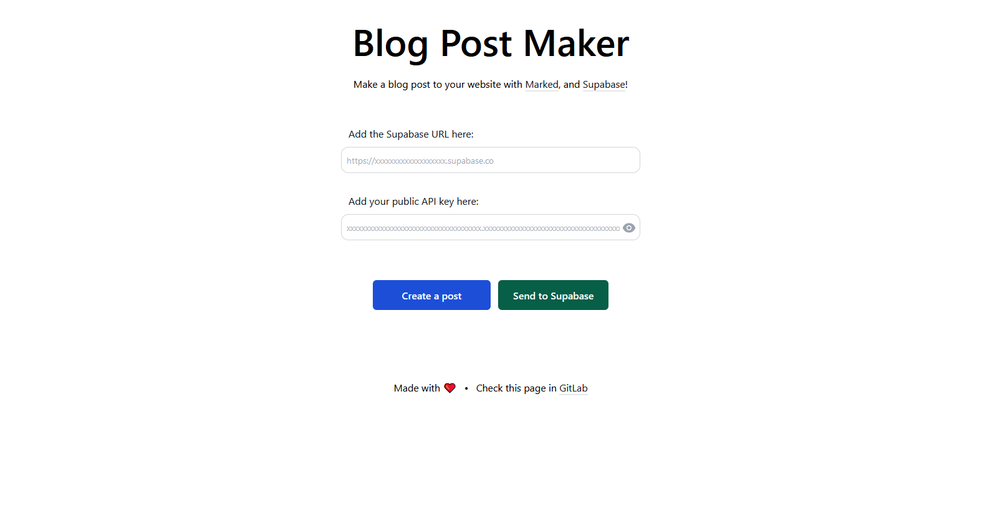
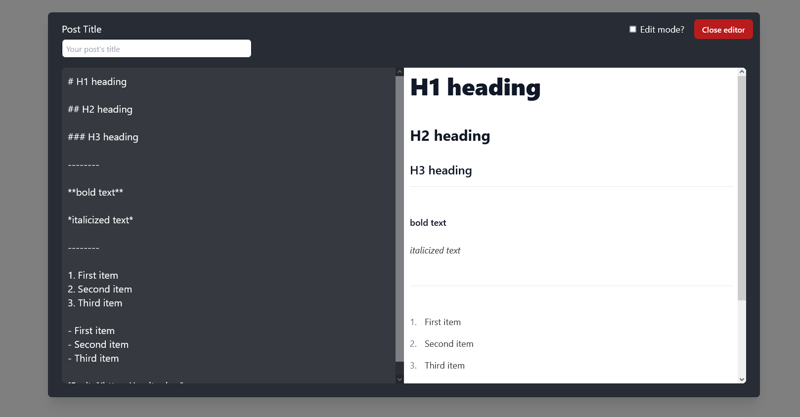
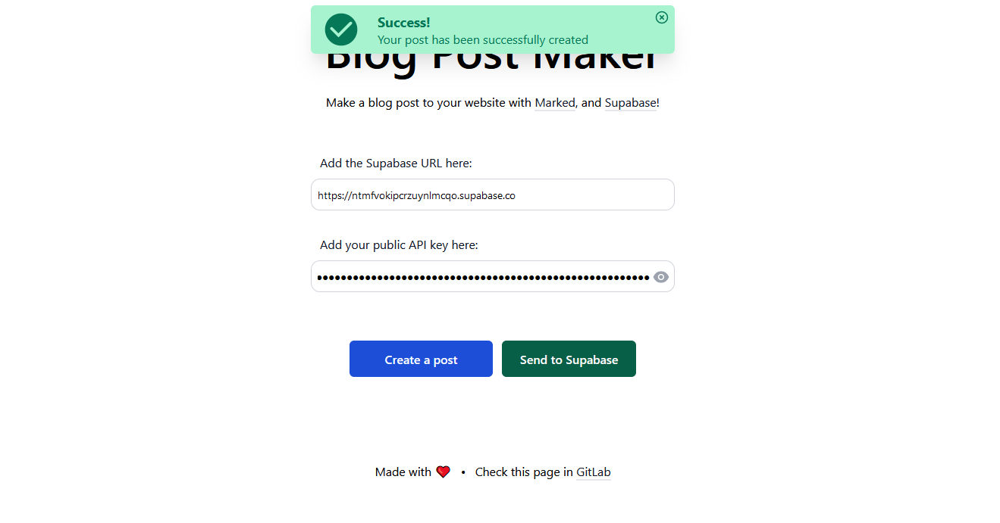
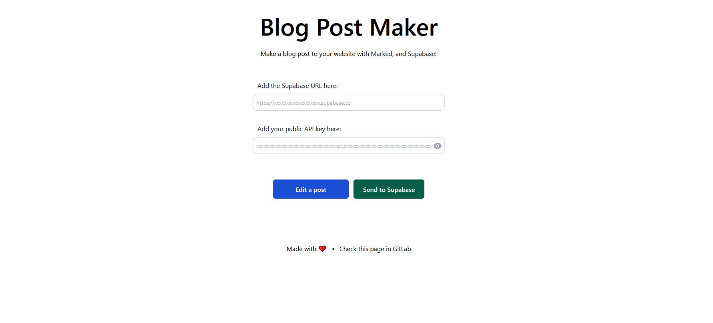
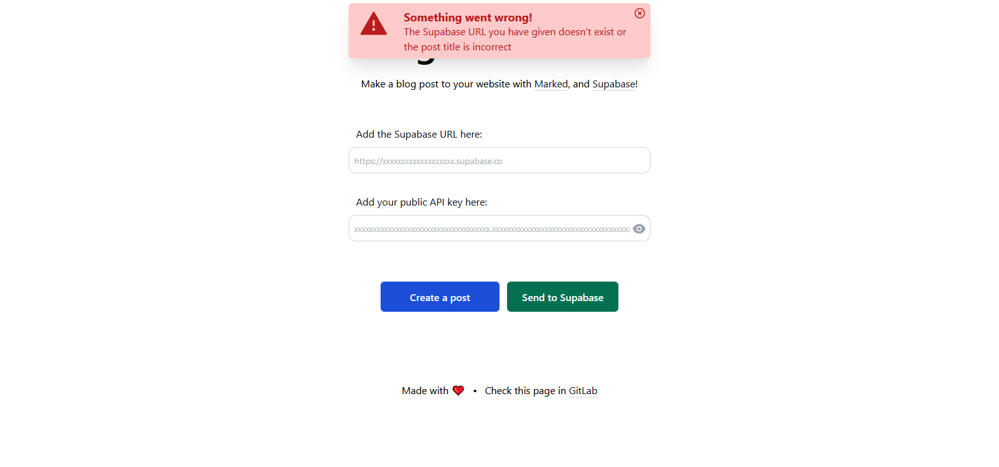

# Blog Post Maker
Make a blog post with [`Marked`](https://marked.js.org/), and [`Supabase`](https://supabase.io/)!

## [Live Demo](https://blog-post-maker.netlify.app)

# Cloning the Repository
** **Note!** Please use `supabase-js` instead of fetching through the URL, since the module provides more functionalities. I used fetching through Supabase URL to communicate with my database, just to get a hang (and learn) with HTTP requests.

1. Create a local folder and do `cd [folder path]`
2. Open your terminal and type `git clone git@gitlab.com:laazyCmd/blog-post-maker.git`
3. Run `npm install` to install all dependencies
4. Run `npm run build` to check any errors
5. Run `npm run dev` and go to [`http://localhost:3000/`](http://localhost:3000/) in your browser to see the website

# Screenshots

